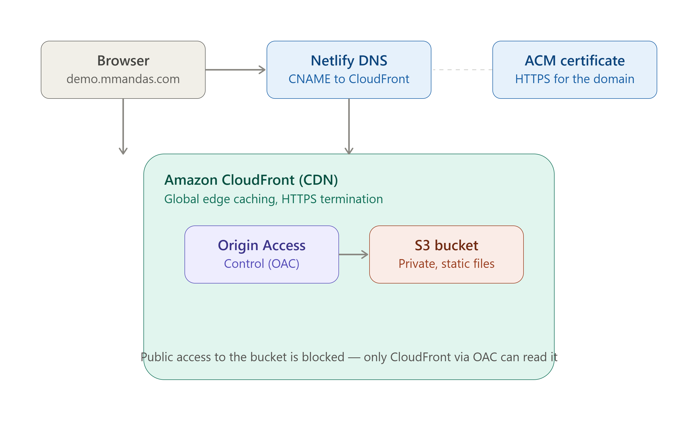
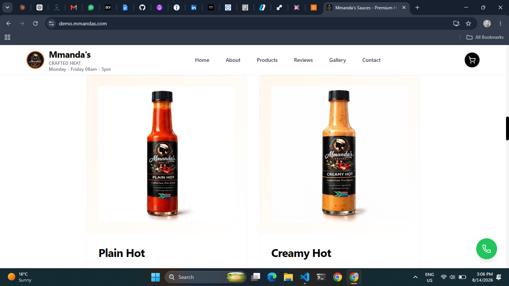
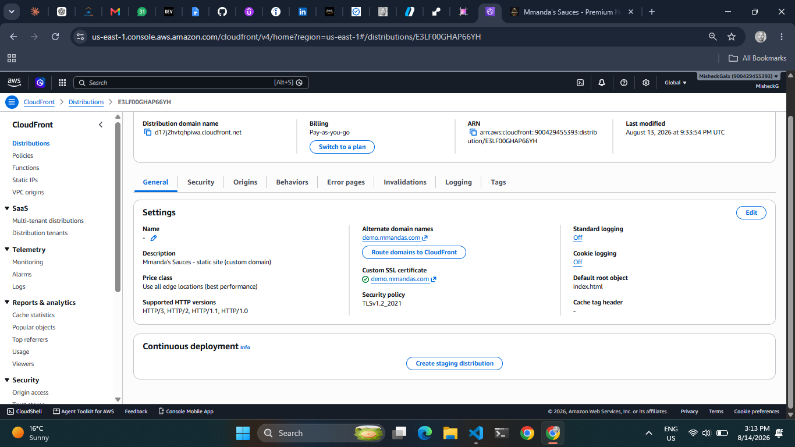
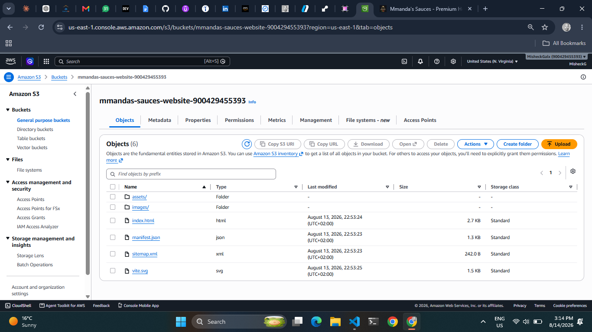
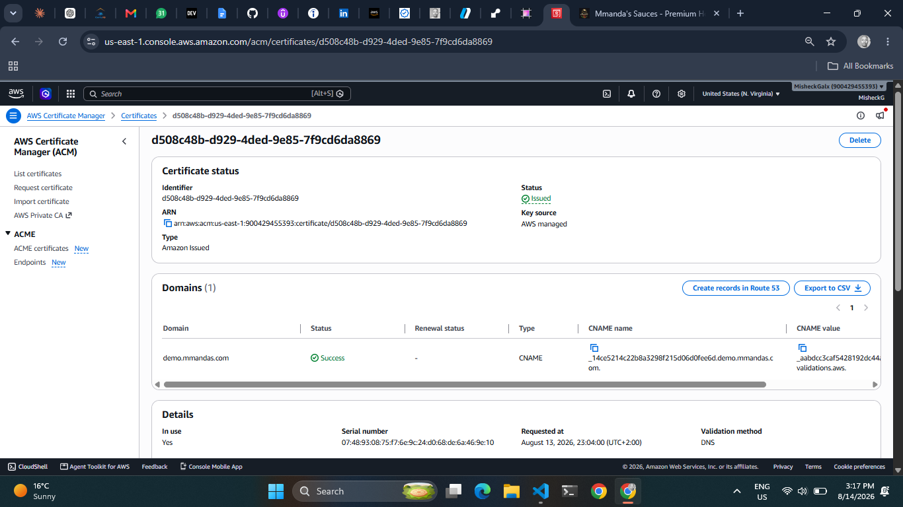
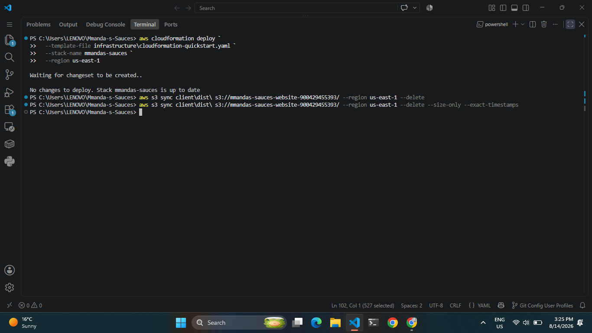
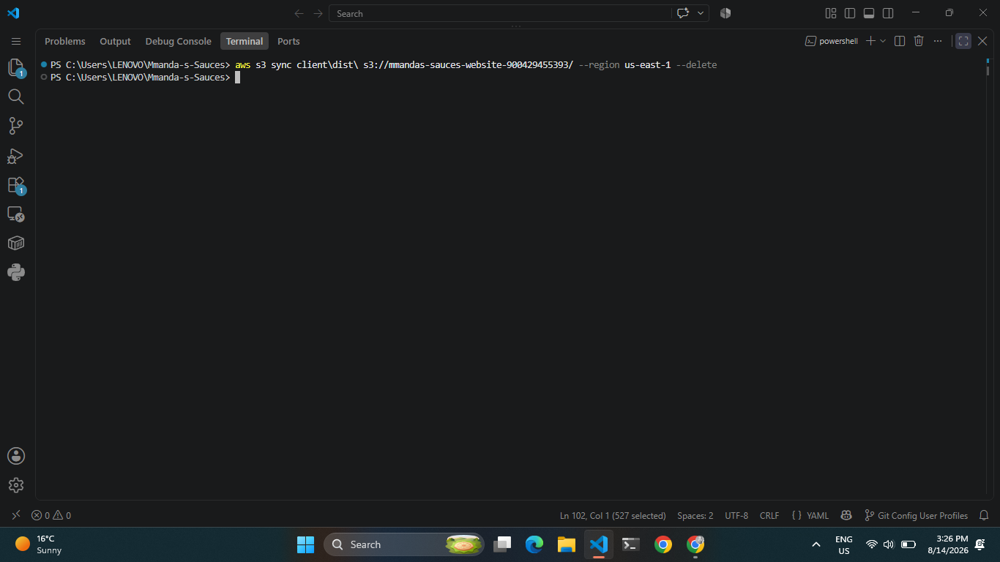

## Live AWS deployment

**Live URL:** https://demo.mmandas.com
_(Production site remains on Netlify at [mmandas.com](https://mmandas.com) — this is a parallel deployment built to demonstrate AWS cloud architecture skills.)_

### What this is

A production-style static site deployment on AWS, provisioned entirely as Infrastructure as Code with CloudFormation. No manual console clicking — every resource below is defined in [`infrastructure/cloudformation-quickstart.yaml`](../infrastructure/cloudformation-quickstart.yaml) and created with a single `aws cloudformation deploy` command.

### Architecture

**Request flow:**
1. Browser requests `demo.mmandas.com`
2. Netlify DNS (CNAME record) resolves the request to the CloudFront distribution
3. CloudFront serves the cached response directly from the nearest global edge location, or fetches from the S3 origin on a cache miss
4. The S3 bucket is **fully private** — public access is blocked at the bucket level. CloudFront reaches it exclusively through **Origin Access Control (OAC)**, so there is no way to bypass the CDN and hit the bucket directly
5. HTTPS is terminated at CloudFront using a free **AWS Certificate Manager (ACM)** certificate, validated via DNS

### AWS services used

| Service | Purpose |
|---|---|
| **Amazon S3** | Object storage for the built static site (HTML/CSS/JS/images) |
| **Amazon CloudFront** | Global CDN — edge caching, HTTPS termination, DDoS-resistant edge |
| **CloudFront Origin Access Control (OAC)** | Locks the S3 bucket so only CloudFront can read it |
| **AWS Certificate Manager (ACM)** | Free, auto-renewing SSL/TLS certificate |
| **AWS CloudFormation** | Infrastructure as Code — the entire stack is reproducible from one template |
| **AWS IAM** | Scoped access credentials (no root account used) |

### Deployment process

\`\`\`bash
# 1. Provision infrastructure (one-time)
aws cloudformation deploy \
  --template-file infrastructure/cloudformation-quickstart.yaml \
  --stack-name mmandas-sauces \
  --region us-east-1

# 2. Build the React app
cd client && npm install && npm run build

# 3. Sync the build to S3
aws s3 sync client/dist/ s3://mmandas-sauces-website-<account-id>/ --delete --region us-east-1

# 4. Invalidate the CloudFront cache
aws cloudfront create-invalidation --distribution-id <distribution-id> --paths "/*"
\`\`\`

### Screenshots

| | |
|---|---|
|  |  |
| Live site on custom domain | CloudFront distribution — Deployed |
|  |  |
| S3 bucket — private, OAC-secured | ACM certificate — Issued |
|  |  |
| \`aws cloudformation deploy\` succeeding | \`aws s3 sync\` uploading the build |

### Notes on scope

The \`/admin\` route (product/order management) depends on a separate Express + SQLite API and was intentionally excluded from this static deployment — it isn't a static asset and needs its own compute (e.g. ECS or Lambda). That's a natural next phase of this project.